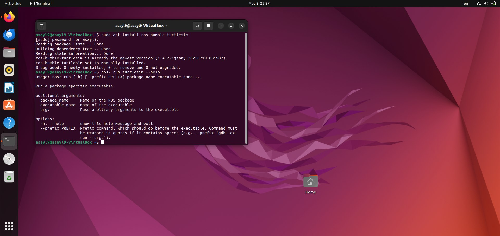

# ROS2 TurtleSim Task


## 1. Task Objective
The goal of this task is to:

- Install ROS2 (Humble)
- Run the TurtleSim package
- Understand the basic concepts of ROS2:
  - Nodes
  - Topics
- Launch the turtlesim node
- Control the turtle using the keyboard

---

## 2. How to Install ROS2 (Humble)

To install ROS2 Humble on **Ubuntu 22.04**, follow the official guide from ROS documentation:

🔗 **[ROS2 Installation Guide – Humble](https://docs.ros.org/en/humble/Installation/Ubuntu-Install-Debians.html)**

> Make sure your system is running **Ubuntu 22.04**, as ROS2 Humble is officially supported on it.

After installation, don’t forget to source ROS2 in every new terminal session:

```bash
source /opt/ros/humble/setup.bash
```

## 3. Installing the `turtlesim` Package

After ROS2 is installed and sourced, you can install the turtlesim demo package using:

```bash
sudo apt install ros-humble-turtlesim
```
Once installed, you can verify the package by running:

```bash
ros2 run turtlesim --help
```
If installed correctly, it will display help information like this:



