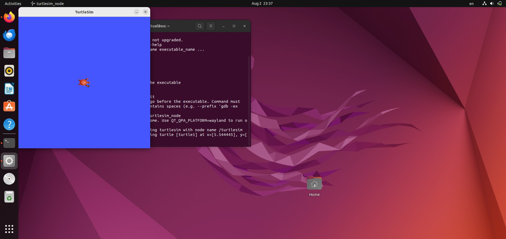
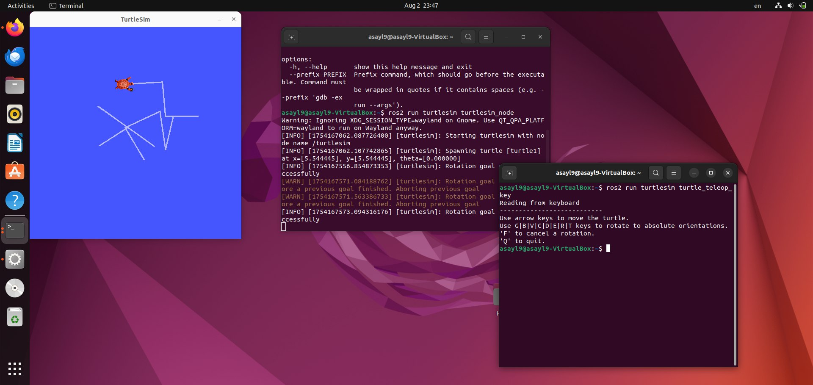
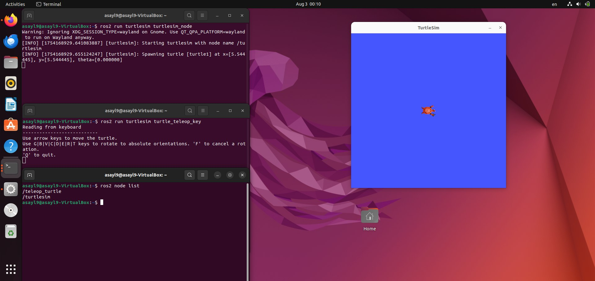
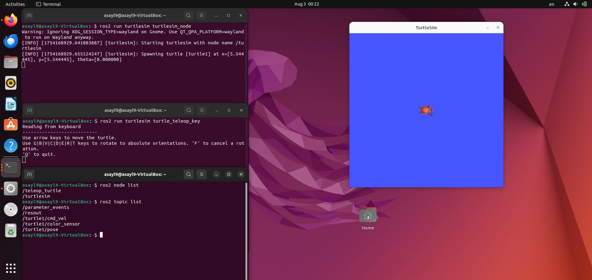

# ROS2 TurtleSim Task


## 1. Task Objective
The goal of this task is to:

- Install ROS2 (Humble)
- Run the TurtleSim package
- Understand the basic concepts of ROS2:
  - Nodes
  - Topics
- Launch the turtlesim node
- Control the turtle using the keyboard

---

## 2. How to Install ROS2 (Humble)

To install ROS2 Humble on **Ubuntu 22.04**, follow the official guide from ROS documentation:

🔗 **[ROS2 Installation Guide – Humble](https://docs.ros.org/en/humble/Installation/Ubuntu-Install-Debians.html)**

> Make sure your system is running **Ubuntu 22.04**, as ROS2 Humble is officially supported on it.

After installation, don’t forget to source ROS2 in every new terminal session:

```bash
source /opt/ros/humble/setup.bash
```

## 3. Installing the `turtlesim` Package

After ROS2 is installed and sourced, you can install the turtlesim demo package using:

```bash
sudo apt install ros-humble-turtlesim
```
Once installed, you can verify the package by running:

```bash
ros2 run turtlesim --help
```
If installed correctly, it will display help information like this:


---

## 4. Launching the `turtlesim` Node

To launch the turtlesim simulation and see the turtle window, run the following command:

```bash
ros2 run turtlesim turtlesim_node
```

This will open a window with a turtle in the center of a colored screen.


---

## 5. Controlling the Turtle

To control the turtle using your keyboard, open a **new terminal window**, and run:

```bash
ros2 run turtlesim turtle_teleop_key
```
Use the arrow keys (↑ ↓ ← →) on your keyboard to move the turtle around the screen.
> Make sure the turtlesim window is already running in another terminal.



---

## 6 Exploring Nodes

#### To see which nodes are currently active in the ROS2 system, run the following command:

```bash
ros2 node list
```
This shows that two nodes are currently running:

/turtlesim: responsible for displaying and updating the turtle simulation.
/teleop_turtle: responsible for reading keyboard input and sending movement commands.



#### To view all active topics used by the running nodes, use the following command:

```bash
ros2 node list
```
This displays a list of topics used for communication between nodes

/turtle1/cmd_vel: where velocity commands are published.
/turtle1/pose: the turtle's position updates.
/parameter_events and /rosout: system-level topics.




نسخ
تحرير
